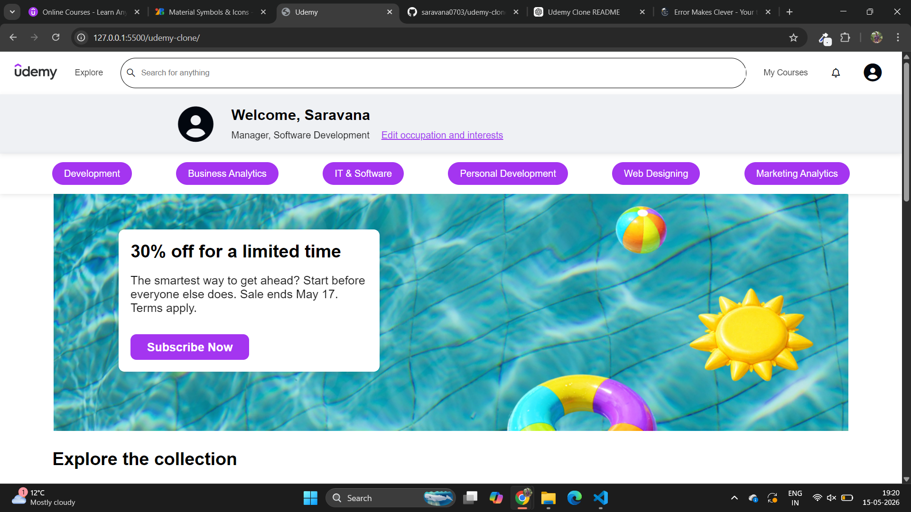

# Udemy Clone 🎓

A responsive **Udemy Clone Website** built using **HTML5** and **CSS3**.  
This project recreates the basic user interface of the Udemy platform, including the navigation bar, course sections, topic recommendations, and footer design.

## 🚀 Project Objective

The main objective of this project is to practice and improve frontend development skills by building a real-world website clone using semantic HTML and modern CSS techniques like Flexbox and Grid.

## 📌 Requirements Implemented

### 1. HTML Structure
- Created semantic HTML5 structure for better readability and accessibility.
- Used sections such as:
  - `header`
  - `nav`
  - `main`
  - `section`
  - `footer`

### 2. Responsive Design
- Built a fully responsive layout using:
  - CSS Flexbox
  - CSS Grid
  - Media Queries
- Ensured compatibility across desktop, tablet, and mobile devices.

### 3. Key Sections Included

#### 🔹 Navbar
- Udemy-style navigation bar
- Includes:
  - Logo
  - Search bar
  - Navigation links
  - Icons/buttons

#### 🔹 Menu Bar
- Designed a category menu bar similar to Udemy.
- Displays different course categories.

#### 🔹 Recommended Courses
- Showcases course cards with:
  - Course image
  - Course title
  - Instructor name
  - Ratings
  - Price details

#### 🔹 Recommended Topics
- Includes an input/search box for topic suggestions.
- Helps users explore learning topics.

#### 🔹 Popular Courses
- Displays trending/popular courses.
- Courses are sorted and displayed based on:
  - Ratings
  - Reviews
  - Popularity

#### 🔹 Footer
- Designed similar to Udemy footer.
- Includes:
  - Useful links
  - Categories
  - About section
  - Copyright information

---

## 🛠️ Technologies Used

- HTML5
- CSS3
- Flexbox
- CSS Grid
- Media Queries
- Font Awesome Icons

---

## 📂 Folder Structure

```bash
Udemy-Clone/
│
├── index.html
├── style.css
├── images/
└── README.md

##Screenshots

